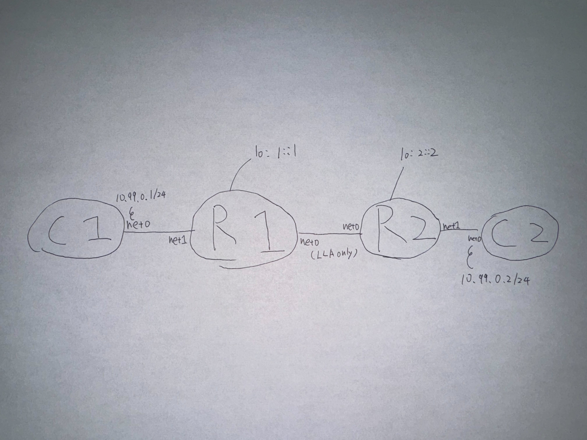

# srv6 l2vpn toybox

SRv6 EVPN VPWSのようなものをインチキで動かす．
全く実用に絶えないが，ちゃんとしたL2VPNを作る時の参考になるはず．

## インチキについて
- clientとの接続IFで，パケットをコピーしてH.Encap.L2相当の何かをした上で隣接ルーターに送信
- 隣接ルーターとの接続IFで，受信したパケットをコピーしてEnd.DX2相当のことをしてclientに送信

## env
- [tinet](https://github.com/tinynetwork/tinet)
## how to use

1. up tinet topology
```
tinet upconf spec.yaml | sh -x
```

2. run encap/decap script at R1 and R2
```
R1# python3 srv6_encap_decap.py [MY_IP] [NEI_IP] [MY_MAC] [NEI_MAC]
```

3. ping 
```
C1# ping 10.99.0.2
```
